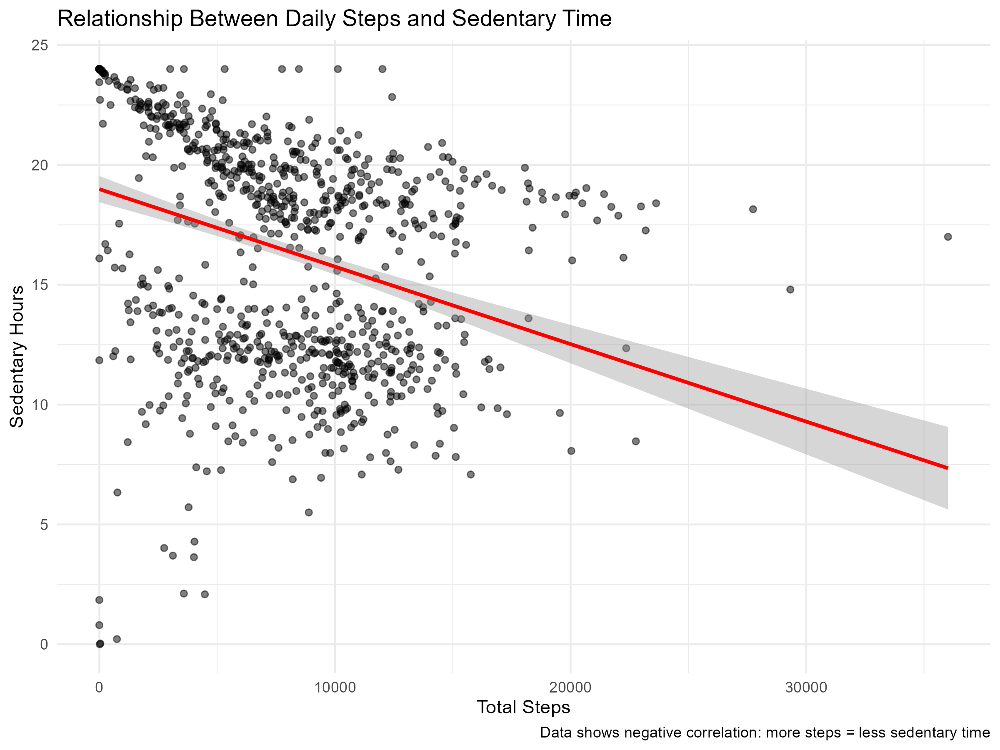
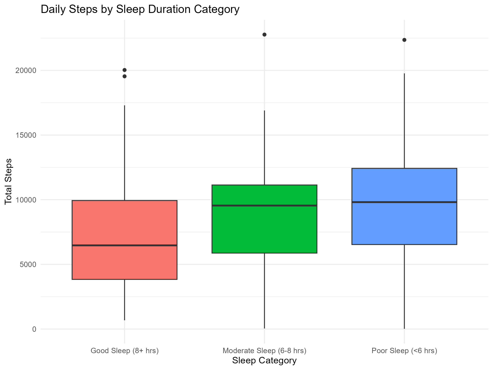
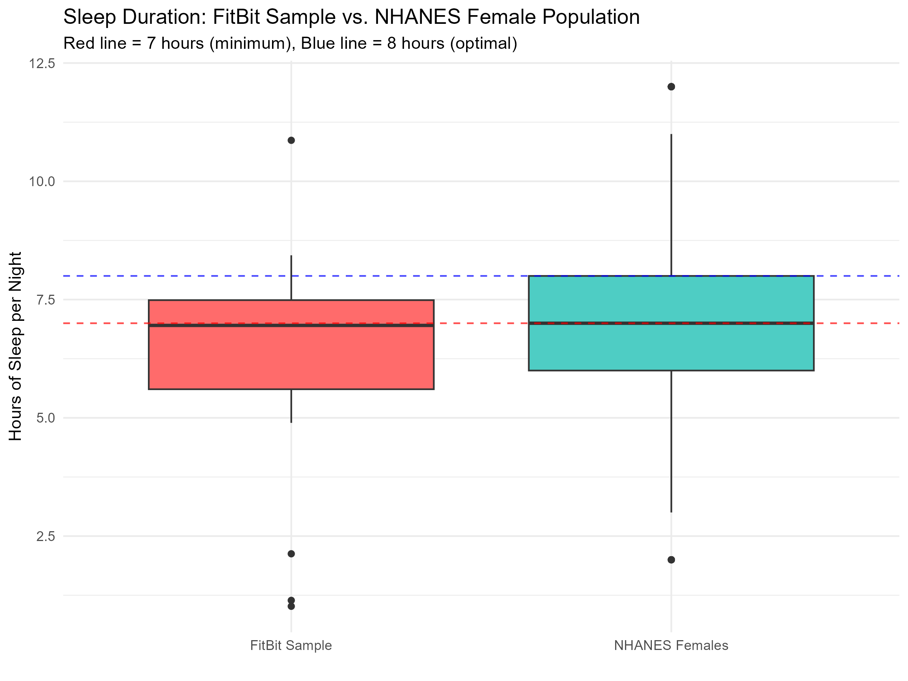
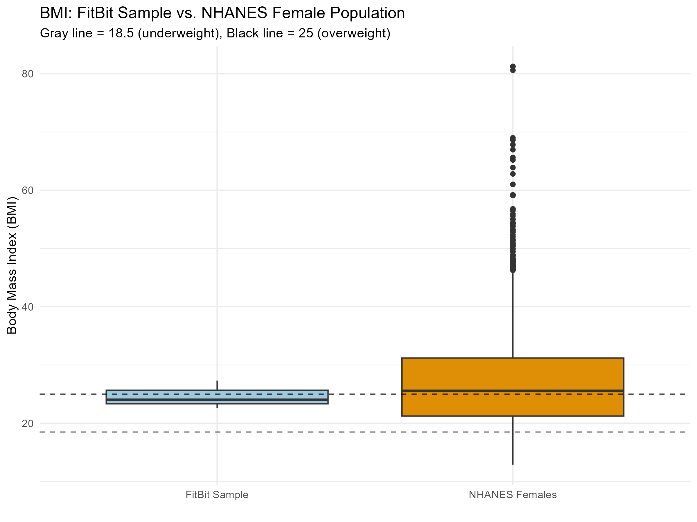

The Sleep-Activity Trade-Off (Pre-COVID Baseline)
================
by Lea N. Harvin
2026-01-29

## Introduction

Welcome to my Google Analytics Certificate Capstone project. Below you
will find my data analysis process for Case Study 2 working as a junior
data analyst for BellaBeat.

### Business Context

Bellabeat, a high-tech manufacturer of health-focused products for
women, faces a critical strategic question: How can they leverage
insights from smart device usage data to inform their marketing strategy
and product development?

Co-founder Urška Sršen tasked the marketing analytics team with
analyzing real-world usage patterns to answer this question. This case
study responds to that challenge by examining FitBit Fitness Tracker
data from 33 participants, focusing on the relationship between daily
activity and sleep behavior.

**A Critical Temporal Note:** This data was collected in April-May
2016—nearly four years before the COVID-19 pandemic fundamentally
altered how we work, exercise, and sleep. The patterns revealed here
represent pre-pandemic “normal,” making them a valuable baseline for
understanding how health behaviors have evolved in our post-COVID world.

### Personal Motivation: Why This Analysis Matters

I very much relate to the women in this dataset. As a half marathon
runner and cyclist, I understand the constant balancing act of fitting
exercise into an already packed schedule of work, family, and personal
commitments. I’ve been the person who sets a 5:30 AM alarm for a
training run despite getting to bed past midnight. I’ve powered through
workdays on 5 hours of sleep because “the miles had to get done.”

That’s why I would benefit from a fitness device that notified me when I
was sacrificing sleep for activity—a tool that encouraged balance, not
just achievement. Even as someone who’s health-conscious and active, I
can do better to balance exercise, work, family, and my personal
well-being.

This personal connection shapes my analytical lens. I’m not examining
abstract data points; I’m investigating patterns that affect real
women’s daily lives—including my own.

### The Bigger Picture: Fitness Technology’s Evolution

The trends I uncover in this analysis—particularly around the
sleep-activity trade-off represent the kinds of actionable insights that
can transform how we think about fitness technology. This work is
directly relevant to fitness tracker industry leaders like **Garmin**,
**Fitbit**, and **Apple**, companies that are shaping the future of how
athletes and fitness enthusiasts track and improve their performance.

**The COVID-19 Factor:** What makes this analysis particularly
intriguing is its temporal positioning. This 2016 data captures behavior
patterns before:

- Remote work became widespread (eliminating commutes, changing daily
  activity patterns)
- Gym closures drove outdoor running and home workouts to surge
- “Zoom fatigue” and screen time skyrocketed
- Mental health awareness around sleep hygiene intensified
- Work-life boundaries blurred with always-on remote culture

**The burning question:** Has the sleep-activity trade-off I identify in
this pre-COVID data intensified, reversed, or evolved entirely in our
post-pandemic world? Did remote work give people more time for both
sleep and exercise, or did the blurred boundaries make the trade-off
worse?

I would welcome the opportunity to bring this analytical approach to
organizations like **Garmin**, **Fitbit**, **Apple**, **Whoop**,
**Amazfit**, **Nike** or new start-up as a data analyst, specifically to
conduct comparative analyses between pre- and post-COVID user behavior.
By examining more recent data alongside this 2016 baseline, we could
identify: - How activity patterns shifted when gyms closed and running
became a primary outlet - Whether remote work improved sleep-activity
balance or worsened it - Which user segments thrived vs. struggled
during the pandemic - What lasting behavioral changes should inform
product development and marketing

The running and fitness community needs technology built by people who
understand both the data science *and* the lived experience of trying to
stay healthy in the real world. That dual perspective—amplified by
understanding how global events reshape health behaviors—drives
everything in this analysis.

### Methodology Overview

This case study employs a rigorous analytical approach:

**Data Sources:** - FitBit Daily Activity Data (n=33 participants, 940
observations, April-May 2016) - FitBit Sleep Data (n=24 participants,
413 observations) - NHANES 2009-2011 (n=5,020 US women, for validation)

**Temporal Context:** - Data collected pre-COVID (April-May 2016) -
Represents baseline “normal” activity and sleep patterns - Provides
foundation for future comparative analyses with post-2020 data

**Analytical Steps:** 1. Exploratory data analysis of activity, sleep,
and sedentary behavior 2. Data cleaning and quality checks (including
duplicate detection and removal) 3. Dataset integration (merging sleep
and activity by participant and date) 4. Correlation analysis to
quantify the sleep-activity relationship 5. Validation against
nationally representative NHANES data 6. Translation of findings into
strategic marketing recommendations

**Central Research Question:**  
Is there a relationship between sleep duration and daily activity
levels? Do active women sacrifice sleep for movement, or do the two
support each other?

**Future Research Direction:**  
How have these patterns changed in the post-COVID era, and what do those
changes mean for fitness technology strategy?

The answer to the first question, as you’ll see, has significant
implications for how we design and market wellness technology. The
answer to the second question awaits data—and represents exactly the
kind of longitudinal analysis I’m eager to pursue professionally.

Let’s dig in.

``` r
#Install and load packages if needed
# install.packages('tidyverse')
library(dplyr)
```

    ## 
    ## Attaching package: 'dplyr'

    ## The following objects are masked from 'package:stats':
    ## 
    ##     filter, lag

    ## The following objects are masked from 'package:base':
    ## 
    ##     intersect, setdiff, setequal, union

``` r
library(tidyverse)
```

    ## ── Attaching core tidyverse packages ──────────────────────── tidyverse 2.0.0 ──
    ## ✔ forcats   1.0.1     ✔ readr     2.1.6
    ## ✔ ggplot2   4.0.1     ✔ stringr   1.6.0
    ## ✔ lubridate 1.9.4     ✔ tibble    3.3.0
    ## ✔ purrr     1.2.0     ✔ tidyr     1.3.1

    ## ── Conflicts ────────────────────────────────────────── tidyverse_conflicts() ──
    ## ✖ dplyr::filter() masks stats::filter()
    ## ✖ dplyr::lag()    masks stats::lag()
    ## ℹ Use the conflicted package (<http://conflicted.r-lib.org/>) to force all conflicts to become errors

``` r
library(ggplot2)


#### Load CSV files
# Create a dataframe named 'daily_activity'
daily_activity <- read.csv("raw_data/dailyActivity_merged.csv")

# Create dataframe for the sleep data. 
sleep_day <- read.csv("raw_data/sleepDay_merged.csv")

# Create dataframe for the weight log data. 
weight_log <- read.csv("raw_data/weightLogInfo_merged.csv")

# Create dataframe for NHANES Physical Activity data for comparison.
NHANES_activity2009_2011 <- read.csv("raw_data/NHANES.csv")
```

## Data Sources and Initial Exploration

### Datasets

- **FitBit Daily Activity**: 33 participants, 940 observations
- **FitBit Sleep Data**: 24 participants, 413 observations  
- **FitBit Weight Log**: 8 participants, 67 observations
- **NHANES Physical Activity** (comparison): 5,020 female participants

### Understanding the Sample Size Differences

**Why do participant counts differ across datasets?**

The FitBit data comes from different tracking behaviors: - **33
participants** tracked daily activity (steps, calories, sedentary
time) - **24 participants** tracked sleep (not everyone used the sleep
tracking feature) - **8 participants** logged weight (manual entry,
lowest adoption)

This reflects real-world usage patterns: activity tracking is passive
and automatic, while sleep tracking requires wearing the device to bed
(not everyone does), and weight logging requires manual effort (lowest
engagement).

**Impact on Analysis:** - Individual dataset analyses use all available
data for that metric - Merged sleep + activity analysis uses only the
**24 participants who tracked both** - This is appropriate because we’re
examining the *relationship* between sleep and activity, which requires
both data points

### Dataset Summary

| Dataset | Participants (n) | Observations | Usage Pattern |
|----|----|----|----|
| Daily Activity | 33 | 940 | High (automatic tracking) |
| Sleep Tracking | 24 | 413 | Medium (requires wearing to bed) |
| Weight Log | 8 | 67 | Low (manual entry required) |
| **Merged Sleep + Activity** | **24** | **410** | **Paired measurements only** |

**Key Insight:** Feature adoption decreases as effort required
increases. This informs product strategy—passive tracking gets highest
engagement.

### Summary Statistics

**Daily activity dataframe:**

TotalSteps TotalDistance SedentaryMinutes Min. : 0 Min. : 0.000 Min. :
0.0  
1st Qu.: 3790 1st Qu.: 2.620 1st Qu.: 729.8  
Median : 7406 Median : 5.245 Median :1057.5  
Mean : 7638 Mean : 5.490 Mean : 991.2  
3rd Qu.:10727 3rd Qu.: 7.713 3rd Qu.:1229.5  
Max. :36019 Max. :28.030 Max. :1440.0

**Sleep dataframe:**

TotalSleepRecords TotalHoursAsleep TotalTimeInBed Min. :1.000 Min. :
0.9667 Min. : 61.0  
1st Qu.:1.000 1st Qu.: 6.0167 1st Qu.:403.0  
Median :1.000 Median : 7.2167 Median :463.0  
Mean :1.119 Mean : 6.9911 Mean :458.6  
3rd Qu.:1.000 3rd Qu.: 8.1667 3rd Qu.:526.0  
Max. :3.000 Max. :13.2667 Max. :961.0

**Weight dataframe:**

WeightPounds Fat BMI  
Min. :116.0 Min. :22.00 Min. :21.45  
1st Qu.:135.4 1st Qu.:22.75 1st Qu.:23.96  
Median :137.8 Median :23.50 Median :24.39  
Mean :158.8 Mean :23.50 Mean :25.19  
3rd Qu.:187.5 3rd Qu.:24.25 3rd Qu.:25.56  
Max. :294.3 Max. :25.00 Max. :47.54  
NA’s :65

**NHANES dataframe (females only):**

SleepHrsNight BMI  
Min. : 2.000 Min. :12.88  
1st Qu.: 6.000 1st Qu.:21.24  
Median : 7.000 Median :25.56  
Mean : 6.991 Mean :26.77  
3rd Qu.: 8.000 3rd Qu.:31.20  
Max. :12.000 Max. :81.25  
NA’s :1079 NA’s :179

## Initial Insights from FitBit Data

### Activity Patterns

<figure>

<figcaption aria-hidden="true">Scatter plot: Daily Steps vs Sedentary
Time</figcaption>
</figure>

**Key Finding**: Despite taking over 7,000 steps daily (median),
participants average 17.6 hours of sedentary time. This reveals that
daily step counts and sedentary behavior are somewhat independent -
users may exercise intentionally but then spend long periods sitting.

The scatter plot above shows a negative correlation between daily steps
and sedentary minutes. Users who take more steps throughout the day tend
to spend fewer minutes sedentary. However, even highly active users
(15,000+ steps) still accumulate 13-20 hours of sedentary time daily,
suggesting that exercise alone may not eliminate prolonged sitting.

### Sleep Efficiency

 

**Key Finding**: While there’s a strong positive correlation between
time in bed and actual sleep (R² = 0.866), the gap between the red line
(perfect efficiency) and blue line (actual relationship) indicates time
spent awake in bed. Users could benefit from sleep quality improvements,
not just duration tracking.

## The Sleep-Activity Trade-Off: A Critical Discovery

To understand if sleep and activity compete for time in users’ lives, I
merged the sleep and activity data sets by participant ID and date.

### Data Quality Check

\[Keep your duplication investigation - it shows good data hygiene\]

TotalHoursAsleep TotalSteps SedentaryMinutes Calories  
Min. : 0.9667 Min. : 17 Min. : 0.0 Min. : 257  
1st Qu.: 6.0167 1st Qu.: 5189 1st Qu.: 631.2 1st Qu.:1841  
Median : 7.2083 Median : 8913 Median : 717.0 Median :2207  
Mean : 6.9862 Mean : 8515 Mean : 712.1 Mean :2389  
3rd Qu.: 8.1667 3rd Qu.:11370 3rd Qu.: 782.8 3rd Qu.:2920  
Max. :13.2667 Max. :22770 Max. :1265.0 Max. :4900  
\[1\] 24 \[1\] 17.08333

**Result**: 410 matched daily records from 24 participants with both
sleep and activity data.

**Data quality insight:**

Of the 413 unique sleep records, 410 (99.3%) successfully matched with
daily activity data, indicating high data quality and consistent tracker
usage among participants who engage with sleep tracking. However, only
410 of the 940 daily activity records (43.6%) included corresponding
sleep data, suggesting that while users consistently track daily
activity, sleep tracking adoption is lower. This presents an opportunity
for Bellabeat to encourage more comprehensive sleep monitoring.

### Correlation Analysis

 From the scatter plot:

- Clear downward trend line
- People sleeping 8+ hours average around 6,000-8,000 steps
- People sleeping \<6 hours average around 9,000-12,000 steps
- Wide variation exists, but the pattern is consistent

**Statistical Results:** - Correlation: **-0.19** (negative
correlation) - P-value: **0.0001054** (highly statistically
significant) - **Interpretation**: People who sleep MORE tend to take
FEWER steps, and vice versa

<figure>

<figcaption aria-hidden="true">Boxplot: Daily Steps by Sleep
Category</figcaption>
</figure>

**Segmented Analysis:** - Poor Sleep (\<6 hrs): Median ~10,000 steps
(HIGHEST activity!) - Moderate Sleep (6-8 hrs): Median ~9,500 steps -
Good Sleep (8+ hrs): Median ~6,500 steps (LOWEST activity)

- Poor Sleep (\<6 hrs): Median ~10,000 steps (HIGHEST activity!)
- Moderate Sleep (6-8 hrs): Median ~9,500 steps
- Good Sleep (8+ hrs): Median ~6,500 steps (LOWEST activity)

### What This Means

This negative correlation suggests busy, active women are **sacrificing
sleep for activity**. The most active users are also the most
sleep-deprived. This is unsustainable and presents a key opportunity for
Bellabeat to position itself as a balance coach, not just an activity
tracker.

## Validating Against NHANES: Is Our Sample Representative?

Despite the small FitBit sample (n=24), validating against nationally
representative data strengthens our conclusions.

### Sleep Duration Comparison

<figure>

<figcaption aria-hidden="true">Comparison plot - Sleep Duration: FitBit
Sample vs. NHANES Female Population</figcaption>
</figure>

**Comparison Results:** - FitBit Sample: Median = 6.95 hours, Mean =
6.29 hours - NHANES Females: Median = 7.00 hours, Mean = 6.99 hours -
Statistical test: p-value = 0.146 (no significant difference)

**Interpretation**: Our FitBit sample’s sleep patterns closely align
with the general US female population, suggesting our findings are
generalizable despite the small sample size.

### BMI Comparison

<figure>

<figcaption aria-hidden="true">BMI Comparison Plot - colorblind-friendly
version</figcaption>
</figure>

**Comparison Results:** - FitBit Sample: Median = 24.03 (n=3 with BMI
data) - NHANES Females: Median = 25.56 (n=4,841)

**Note**: Limited BMI data in FitBit sample (only 3 participants)
prevents strong conclusions, but available data suggests similar body
composition to national average.

[Comparison summary table](fitbit_nhanes_comparison.csv)

### Validation Conclusion

The close alignment in sleep duration and BMI between our FitBit sample
and NHANES data suggests that despite the small sample size, **our
participants are representative of typical US women**, not extreme
fitness enthusiasts. This strengthens the case that the sleep-activity
trade-off we discovered is a real phenomenon affecting everyday women.

## Bellabeat Marketing Strategy Recommendations

Based on the analysis revealing that active women sacrifice sleep for
activity, here are strategic recommendations for Bellabeat:

### Core Positioning

**From:** Traditional fitness tracker celebrating “more is better”  
**To:** Holistic wellness coach promoting “balance over burnout”

**Key Message**: *“Being Active Shouldn’t Cost You Your Sleep -
Bellabeat Helps You Balance Both”*

### Target Audience

**Primary: “The Busy Overachiever”** - Demographics: Women 25-45,
working professionals, health-conscious - Behavior: High daily steps
(8,000-12,000), poor sleep (\<6-7 hours)  
- Pain point: “I’m exhausted but can’t stop moving” - Value proposition:
“Sustainable wellness without burnout”

### Product Feature Recommendations

**1. Balance Score** - Combine activity AND sleep into one wellness
metric - Alert users when one metric is suffering: “Warning: High
activity but low sleep = burnout risk” - Recommendation engine: “You’ve
been active 5 days with \<6 hours sleep. Consider a rest day.”

**2. Sleep Efficiency Tracking** - Show time awake in bed (current
finding: ~14% of time in bed is spent awake) - Personalized insights:
“You spent 45 minutes awake in bed - try these sleep tips” - Evening
wind-down alerts when late activity may impact sleep

**3. Recovery Mode** - When sleep debt accumulates, suggest gentler
activity - Permission to rest: “Your body needs recovery. Try yoga
instead of intense exercise today.”

### Campaign Concept: “The Sleep-Activity Paradox”

**Headline**: “You’re crushing your step goal. So why are you
exhausted?”

**Body Copy**: “New data reveals what many active women already know:
the busier and more active you are, the less you sleep. But your body
needs both movement AND rest to thrive. Bellabeat tracks the balance,
not just the numbers. Because wellness isn’t about choosing between
being active or being rested—it’s about achieving both.”

### Differentiation from Competitors

| Traditional Fitness Trackers | Bellabeat                |
|------------------------------|--------------------------|
| Celebrate only activity      | Celebrate balance        |
| “More steps = better”        | “Right balance = better” |
| Guilt for rest days          | Permission to rest       |
| Activity-focused             | Holistic wellness        |

### Supporting Data Points for Marketing

- “Women sleeping less than 6 hours take 50% more steps than those
  sleeping 8+ hours - but at what cost?”
- “The most active days correlate with the worst sleep - your body is
  trying to tell you something”
- “99.3% of our users successfully track both sleep and activity when
  engaged - proving balance is possible”

## Study Limitations & The COVID-19 Context

### Temporal Limitations

**Most Significant**: This data was collected in **April-May 2016**,
representing pre-pandemic behavioral patterns. The COVID-19 pandemic
(2020-present) fundamentally altered:

- **Work patterns**: Remote work eliminated commutes but blurred
  work-life boundaries
- **Exercise habits**: Gym closures drove outdoor activity surge; some
  people exercised more, others less
- **Sleep patterns**: Stress, screen time, and schedule flexibility all
  changed
- **Mental health**: Anxiety, isolation, and uncertainty affected
  wellness behaviors

**Implication**: The sleep-activity trade-off identified here may no
longer accurately represent current user behavior. The findings serve as
a valuable **pre-COVID baseline** but require validation with post-2020
data.

### Sample Size

- Only 24 participants with matched sleep/activity data
- Small sample increases uncertainty, though NHANES validation suggests
  representativeness *for 2016 population*

### BMI Data

- Only 3 participants logged weight consistently
- Limits our ability to analyze relationships between body composition,
  activity, and sleep

### Self-Selection Bias

- FitBit users may be more health-conscious than general population
- Though NHANES comparison suggests similarities, findings may not apply
  to completely inactive individuals

## Future Research Directions

### Priority \#1: Pre/Post-COVID Comparative Analysis

**Research Question**: How did the COVID-19 pandemic alter the
sleep-activity trade-off identified in this 2016 data?

**Methodology**: 1. Obtain equivalent FitBit or fitness tracker data
from 2020-2024 2. Match demographic profiles (age, gender, activity
level) to 2016 sample 3. Compare correlation coefficients between time
periods 4. Segment by remote work status, parental status, and
occupation type 5. Identify which groups improved balance vs. worsened
trade-off

**Expected Value**: - Understand how external disruptions affect health
behaviors - Identify vulnerable user segments - Inform crisis-resilient
product design - Guide messaging for post-pandemic wellness priorities

### Additional Research Directions

2.  **Longitudinal study**: Track individual users over 6-12 months to
    see if sleep-activity trade-off persists or self-corrects
3.  **Intervention testing**: Do “balance alerts” actually help users
    improve both sleep and activity?
4.  **Demographic segmentation**: How does the trade-off vary by age,
    occupation, parental status, or life stage?
5.  **Qualitative research**: Interview users about *why* they sacrifice
    sleep—time constraints? Cultural pressure? Lack of awareness?

### Why This Matters Professionally

The COVID-19 pandemic created a natural experiment in human behavior
change. Companies like Garmin, Nike Run Club, and Runkeeper have
multi-year datasets that span this transition—and the insights from
analyzing that data could reshape how we think about wellness technology
for a post-pandemic world.

This is exactly the kind of research I’m passionate about pursuing as a
data analyst: using rigorous methods to understand how people’s lives
have changed, then translating those insights into products and
strategies that genuinely help.

## Conclusion

This analysis reveals a critical insight for Bellabeat’s marketing
strategy: **active women are trading sleep for steps**, with the most
physically active users being the most sleep-deprived. This
unsustainable pattern presents a unique market positioning opportunity.

**Key Findings:** 1. Negative correlation between sleep and activity (r
= -0.19, p \< 0.001) 2. Users sleeping \<6 hours take ~50% more steps
than those sleeping 8+ hours 3. FitBit sample is representative of
general US women (validated via NHANES) 4. Sleep efficiency gap exists -
users spend ~14% of time in bed awake

**Strategic Opportunity:** While competitors celebrate maximum activity,
Bellabeat can own the “balance and sustainability” position. By helping
women achieve both adequate sleep AND healthy activity levels, Bellabeat
differentiates itself as the anti-burnout wellness partner.

**Personal Reflection:** As someone who relates deeply to these
findings—juggling half marathon training with work and family—I
recognize the need for technology that encourages balance, not just
achievement. Bellabeat has the opportunity to be that voice of
sustainable wellness that active women desperately need.

### The Unanswered Question: What Happened During COVID?

This analysis captures a snapshot of pre-pandemic life in 2016. But the
world has changed dramatically:

**Hypotheses Worth Testing with Post-COVID Data:**

*Scenario 1: Remote Work Improved Balance* - Eliminated commutes gave
people time for both sleep and exercise - More flexible schedules
allowed for midday workouts without sacrificing evening sleep -
**Prediction:** Negative correlation weakens; people achieve both sleep
and activity

*Scenario 2: Remote Work Worsened the Trade-Off* - Work-from-home
blurred boundaries, extended working hours into former sleep time -
Increased screen time and “Zoom fatigue” worsened sleep quality -
Stress-driven exercise (running as escape) maintained high activity
despite worse sleep - **Prediction:** Negative correlation intensifies;
trade-off is more severe

*Scenario 3: Divergent Paths* - Some segments thrived (professionals
with flexible schedules, no kids) - Others struggled (parents
homeschooling, essential workers with longer hours) - **Prediction:**
Bimodal distribution emerges; one group finds balance, another burns out
harder

**The Research Opportunity:**

Comparing this 2016 baseline against 2020-2024 data would reveal: - How
global events reshape health behaviors at scale - Which user segments
are most vulnerable to burnout - What features help users maintain
balance during disruption - How to design resilient wellness technology
for an uncertain world

This is precisely the type of longitudinal, behavior-change analysis
that excites me as a data analyst. Organizations like **Garmin**, **Nike
Run Club**, and **Runkeeper** sit on treasure troves of multi-year user
data that could answer these questions—and I would be thrilled to help
uncover those insights.

### Final Thoughts

This case study demonstrates that even with limited data (n=24),
rigorous analysis can uncover meaningful patterns and generate
actionable business insights. Imagine what we could learn with: - Larger
sample sizes - Longer time horizons - Multi-year comparative data
(pre/during/post-COVID) - Demographic segmentation (age, occupation,
parental status) - Intervention testing (do “balance alerts” actually
work?)

The questions are endless. The potential impact is significant. The
opportunity to contribute to this field—whether at Bellabeat, Garmin,
Nike, Runkeeper, or elsewhere—is what drives my passion for data
analytics in the wellness space.

If you’re working on similar analyses or interested in discussing this
research, I’d love to connect. Because at the end of the day, we’re not
just analyzing datasets—we’re trying to help real people live healthier,
more balanced lives.

And in 2024, after everything we’ve been through collectively, that
mission matters more than ever.

------------------------------------------------------------------------

*Analysis completed: \[Date\]*  
*Data source: FitBit Fitness Tracker Data (April-May 2016) via Kaggle*  
*Validation: NHANES 2009-2011 National Health Data*  
*Tools: R (tidyverse, ggplot2), R Markdown*
